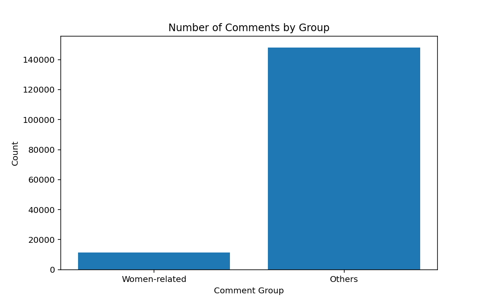
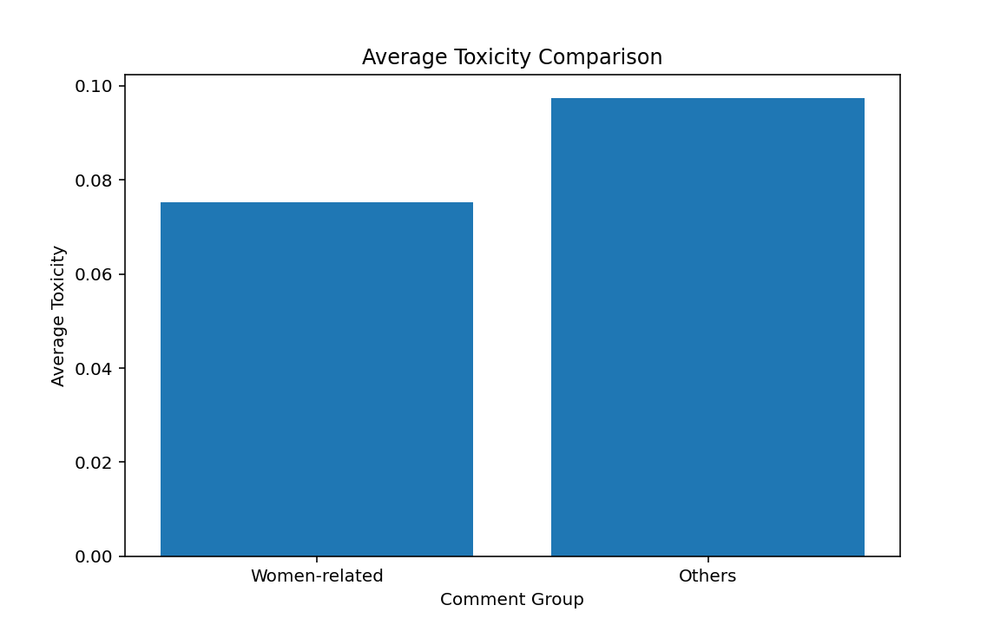
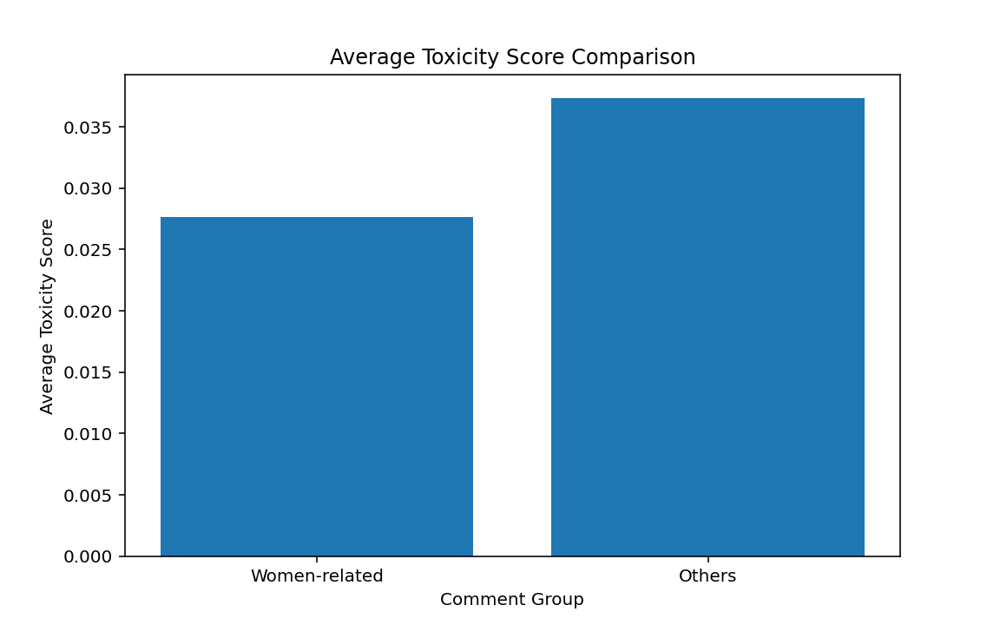
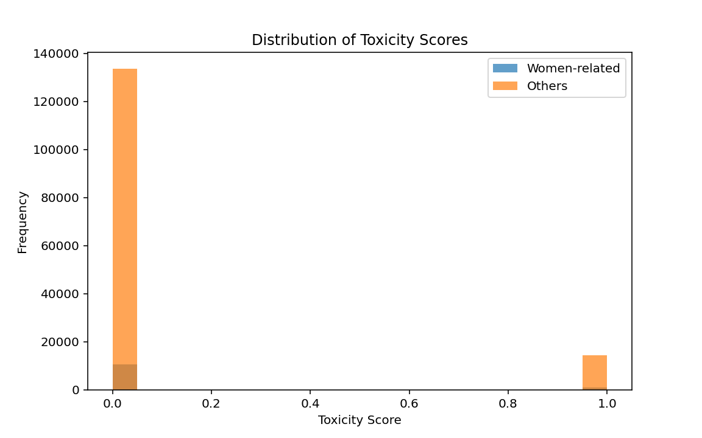
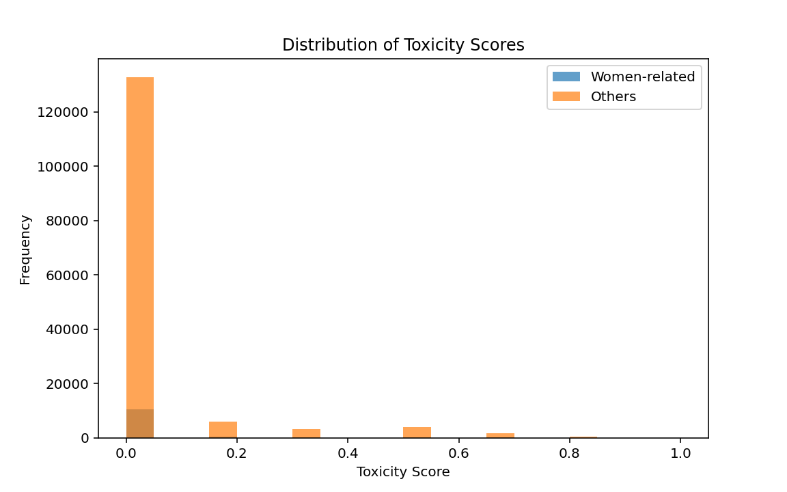
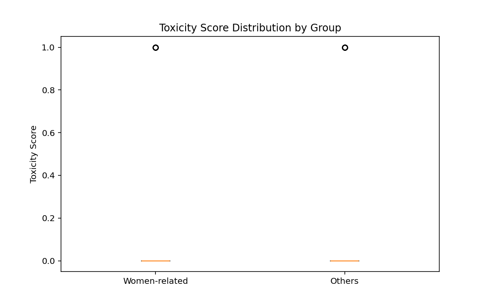
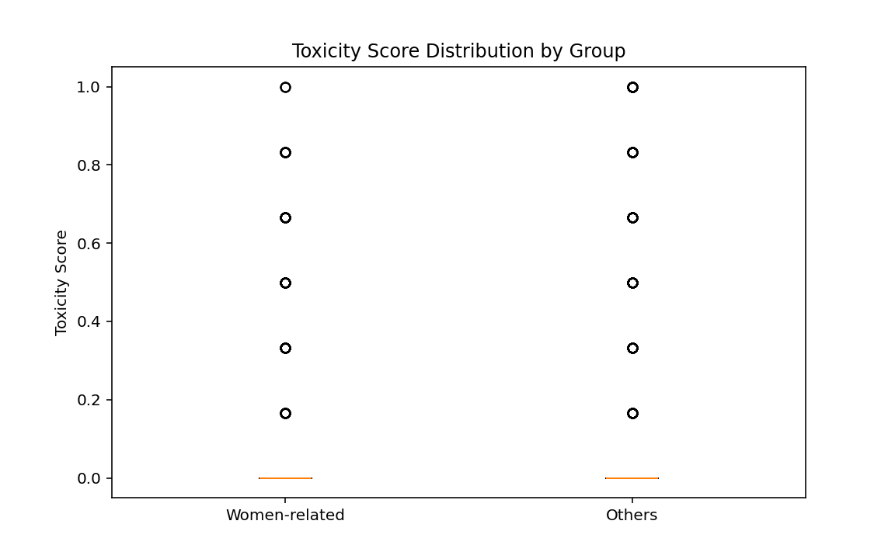

# 📊 Gender Bias in Online Toxicity Analysis

## 🧠 Project Overview

This project investigates whether comments containing female-related expressions exhibit more negative sentiment compared to general online comments.

The motivation behind this study is to explore potential gender bias in online communication and understand how women-related language is treated in digital platforms.

---

## 🎯 Research Question

Is there a statistically significant difference in sentiment between comments containing female-related expressions and general online comments?

---

## 📊 Dataset

This project uses publicly available datasets:

- Jigsaw Toxic Comment Classification Dataset  
- Twitter Hate Speech Dataset  

These datasets include thousands of online comments and tweets labeled with toxicity or sentiment-related information.

---

## 🔧 Data Preparation

The following preprocessing steps are applied:

- Text cleaning (lowercasing, removing punctuation, links, etc.)
- Keyword filtering to identify women-related comments  
  (e.g., "she", "woman", "female", "girl")
- Creation of a new feature: `women_related`
- Calculation of a toxicity score using available labels

---

## 📈 Analysis

The analysis includes:

- Exploratory Data Analysis (EDA)
- Comparison of average toxicity between:
  - Women-related comments  
  - Other comments
- Visualization using bar charts and histograms
- Statistical testing (t-test) to evaluate significance

---

## 🤖 Machine Learning

A simple classification model (Logistic Regression) is used to:

- Predict whether a comment is toxic
- Explore patterns in textual data

Text data is transformed using TF-IDF vectorization.

---

## 📊 Expected Findings

The project aims to determine whether:

- Women-related comments have higher average toxicity
- The observed difference is statistically significant

---

## ⚠️ Limitations

- Keyword-based filtering may not capture full context
- Some comments may include female-related words without targeting women
- Dataset biases may affect results
- Sentiment analysis may miss sarcasm or context

---

## 🚀 Future Work

- Use advanced NLP models (e.g., BERT)
- Improve keyword filtering with context-aware methods
- Expand datasets from multiple platforms
- Analyze cultural or language differences

---

## 🛠️ Technologies Used

- Python  
- Pandas  
- NumPy  
- Matplotlib  
- Scikit-learn  
- SciPy  

---
## Visualizations

### 1. Comment Group Counts

### 2. Average Toxicity Comparison

### 3. Average Toxicity Score Comparison

### 4. Toxicity Distribution Histogram

### 5. Toxicity Score Histogram

### 6. Toxicity Boxplot

### 7. Toxicity Score Boxplot

## 📂 Project Structure
